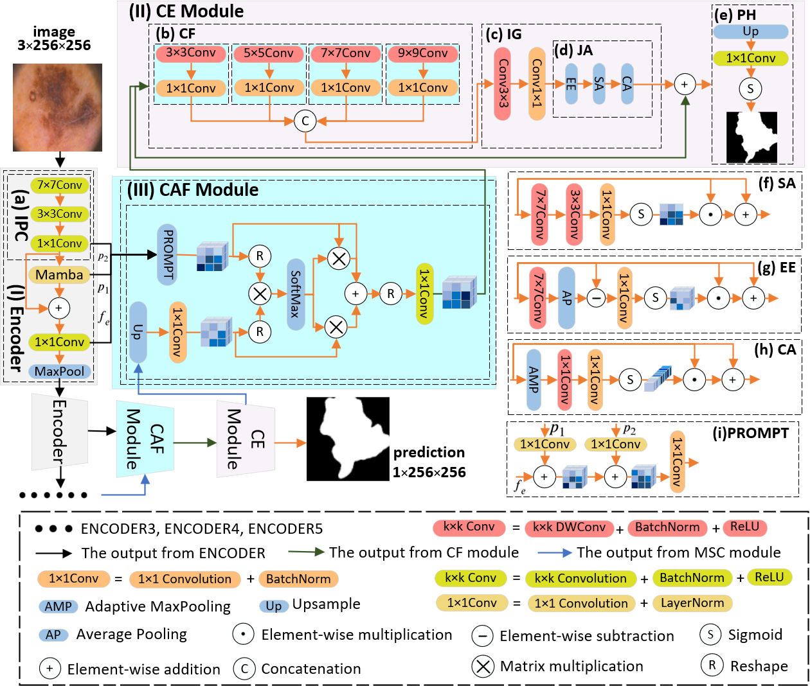
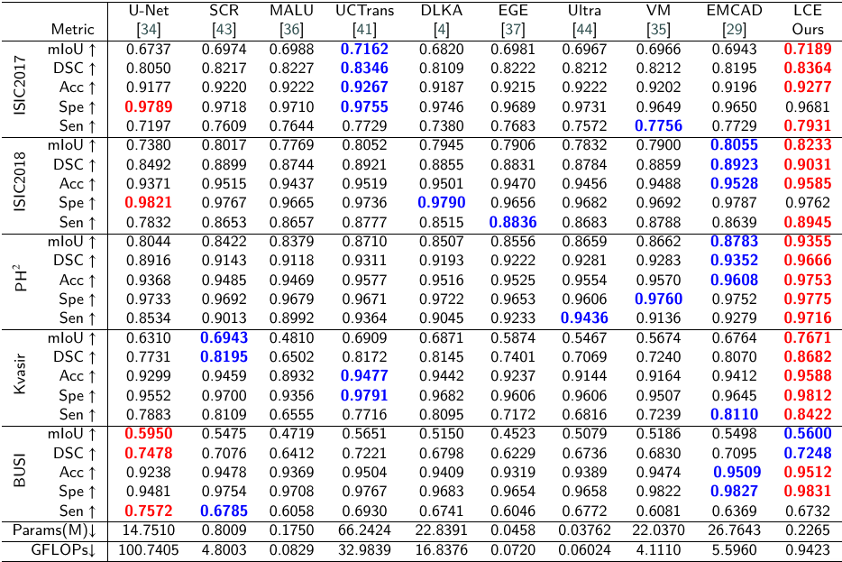

# LCENet

👋 [GitHub Repo stars: https://github.com/Panpz202006/MSCNet/tree/xyq_branch]

## 1. Abstract:

Medical image segmentation has garnered significant attention. However, existing methods struggle with challenges such as blurry boundaries, background interference, and complex structures. To address these issues, we propose LCANet, which aims to highlight salient regions, locate target objects, and capture edge details.LCANet employs an inverted pyramid convolutional layer structure to extract global and local contextual information progressively from coarse to fine. It integrates Mamba to fully exploit salient regions within complex tissues. To facilitate feature propagation and enhance the model's ability to locate complex tissues, we introduce Self-Prompts that generate two sets of mask prompts. LCANet also adopts a novel multi-scale feature processing mechanism, using parallel depthwise separable convolutions to extract global context and local details from different receptive fields. It incorporates innovative edge enhancement, spatial attention, and channel attention mechanisms to adaptively capture edge information, extract complex spatial relationships, and comprehensively understand the intricate structures and contours of tissues. Furthermore, LCANet utilizes an innovative cross-attention mechanism, leveraging a single-head self-attention mechanism to effectively promote the synergy between deep high-level semantic clues and shallow low-level texture details. This approach results in more comprehensive feature maps while reducing the computational burden and redundancy associated with traditional self-attention mechanisms.	Extensive experimental results demonstrate that LCANet outperforms state-of-the-art methods across five medical image segmentation datasets in three domains (three skin lesion datasets, one polyp dataset, and one breast cancer dataset). 

## 2. Overview:

<div align="center">

</div>


## 3. Main Environments:

```
conda create -n LCENet python=3.8
conda activate LCENet
pip install torch==1.13.0 torchvision==0.14.0 torchaudio==0.13.0 --extra-index-url https://download.pytorch.org/whl/cu117
pip install packaging
pip install timm==0.4.12
pip install pytest chardet yacs termcolor
pip install submitit tensorboardX
pip install triton==2.0.0
pip install causal_conv1d==1.0.0  # causal_conv1d-1.0.0+cu118torch1.13cxx11abiFALSE-cp38-cp38-linux_x86_64.whl
pip install mamba_ssm==1.0.1  # mmamba_ssm-1.0.1+cu118torch1.13cxx11abiFALSE-cp38-cp38-linux_x86_64.whl
pip install scikit-learn matplotlib thop h5py SimpleITK scikit-image medpy yacs
```

## 4. Datasets: 

- Download datasets: ISIC2017 from this [link](https://challenge.isic-archive.com/data/#2017), ISIC2018 from this [link](https://challenge.isic-archive.com/data/#2018), and PH2 from this [link](https://www.dropbox.com/scl/fi/epzcoqeyr1v9qlv/PH2Dataset.rar?rlkey=6mt2jlvwfkditkyg12xdei6ux&e=1), Kvasir from this[link](https://link.zhihu.com/?target=https%3A//datasets.simula.no/downloads/kvasir-seg.zip), and BUSI from this [link](https://scholar.cu.edu.eg/?q=afahmy/pages/dataset).

- Folder organization: put ISIC2017 datasets into ./data/ISIC2017 folder, ISIC2018 datasets into ./data/ISIC2018 folder, and PH2 datasets into ./data/PH2 folder, Kvasir datasets into ./data/Kvasir folder, and BUSI datasets into ./data/BUSI folder.
  
## 5. Train the LCENet:

```
python train.py --datasets ISIC2018
training records is saved to ./log folder
pre-training file is saved to ./checkpoints/ISIC2018/best.pth
concrete information see ./LCENet/train.py, please
```

## 6. Test the LCENet:

```
python test.py --datasets ISIC2018
testing records is saved to ./log folder
testing results are saved to ./Test/ISIC2018/images folder
concrete information see ./LCENet/test.py, please
```
  
## 7. Comparison With State of the Arts:

<div align="center">

</div>

<div align="center">

</div>

<div align="center">

</div>

<div align="center">

</div>

## 8. Acknowledgement:

Thanks to UltraLight-VM-UNet and SHViT for his outstanding works and .